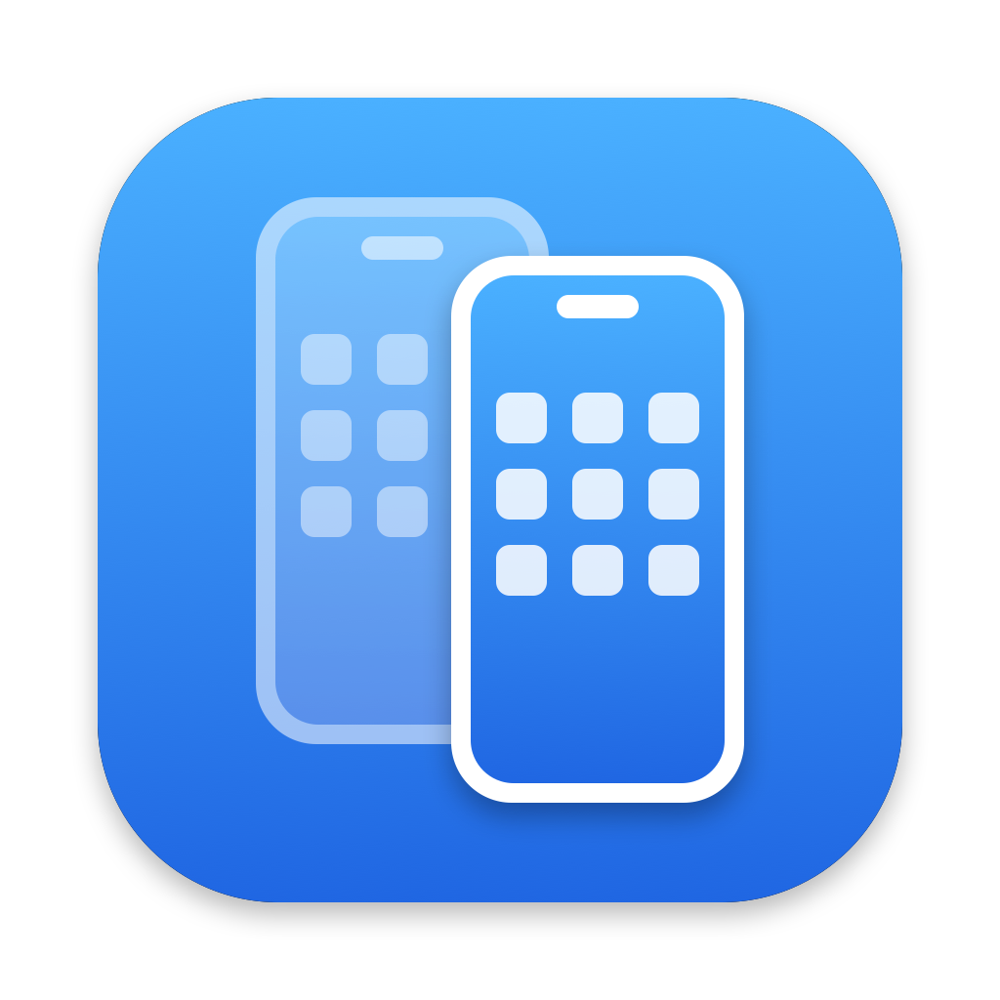
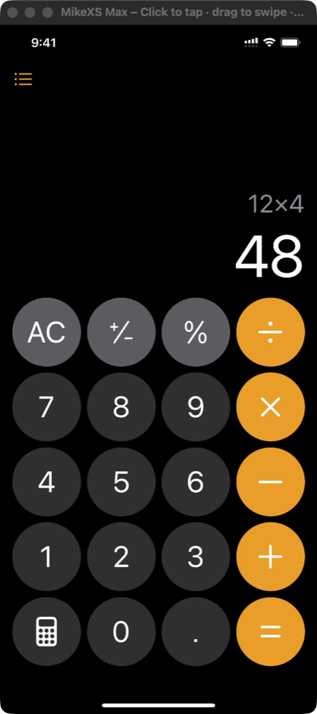

#  phonebooth

Mirror and control a few iPhones and iPads at once from your Mac over USB

macOS

<!-- media: hero -->


[Watch it run (8 seconds)](docs/demo.mp4)
<!-- /media: hero -->

## What it is

Plug in an iPhone or iPad with a cable and it pops up in its own window on the Mac. Plug in a few and they each get one. You click to tap, drag to swipe, scroll to scroll and just type to type.

Apple's own iPhone Mirroring only does one phone over Wi-Fi, so this does a few more than that. The control side goes through WebDriverAgent, which takes a minute to set up the first time but then starts in a few seconds.

## Get it

Paste this into your AI coding agent (Claude Code, Codex, Cursor...):

> Clone https://github.com/mikecann/phonebooth and make it my own. It's one of Mike
> Cann's personal tools, so read the README first, change anything specific to his
> setup to suit mine, then help me get it running.

### Or set it up by hand

You'll need macOS 14 or later, full Xcode with its command line tools selected,
and a USB cable for each phone. Phone control also needs an Apple developer
team and Developer Mode on the phone, as described below.

```bash
git clone https://github.com/mikecann/phonebooth.git
cd phonebooth
bash install.sh
bash setup_mac.sh
```

`install.sh` links the `phonebooth` command into `~/.local/bin`. It prints the
line to add to your shell config if that directory isn't on PATH. You can pick
another directory with `bash install.sh /path/to/bin`. Re-run it if you move
the clone.

`setup_mac.sh` builds and signs `~/Applications/Phonebooth.app`. Launch
**Phonebooth** from Spotlight, or run `phonebooth`. No API keys or `.env` file
are needed.

Control needs a few one-off steps:

1. **Sign into Xcode** with an Apple ID that's in a paid Apple Developer Program
   team (Xcode > Settings > Accounts). A free Apple ID works too, but its signing
   expires after 7 days
2. **Turn on Developer Mode** on each phone (Settings > Privacy & Security >
   Developer Mode). It appears once the phone has been plugged into a Mac with
   Xcode
3. **Plug the phone in and unlock it.** The first time, Phonebooth builds the
   helper, signs it with your team and registers the phone. That takes about a
   minute. After that it starts in a few seconds whenever the phone is unlocked

The helper app, WebDriverAgentRunner, appears on each phone's home screen. With
a paid team its signing lasts a year. When it expires, Phonebooth rebuilds it
automatically.

macOS asks for Camera permission the first time, because it treats a phone's
screen as a camera.

## Using it

- Opens a window for every iPhone or iPad plugged in with a cable, and closes it
  when the phone is unplugged. Plug in several and each gets its own window
- Shows the phone's screen at full resolution. The window keeps the phone's
  shape, follows it when it rotates, and remembers where you left it for each phone
- Sends your clicks, drags, scrolling and typing to the phone through
  WebDriverAgent, Apple's UI-testing runner, over the same cable
- Shows a ripple where each click landed, so you can see where the tap went while
  the phone catches up
- Keeps each mirrored phone from auto-locking while it's unlocked, by pressing
  Shift every 20 seconds. That types nothing, but it counts as input. Turn it off
  with **Phones > Keep Phones Awake**. A locked phone is left alone
- The status bar reads 9:41 with full signal and battery while a phone is
  mirrored. iOS does this for any cabled screen capture, which suits recordings

### Controls

| Input | On the phone |
|---|---|
| Click | Tap |
| Click and hold | Long press |
| Right-click | Long press |
| Drag | Swipe, replayed with your timing |
| Scroll wheel or trackpad | Scroll by exactly that much, without flinging |
| Typing | Types into whatever field is focused |
| ⌘V | Types the Mac clipboard into the phone |
| ⇧⌘H | Home |

| Mac shortcut | Action |
|---|---|
| ⌘1 to ⌘9 | Bring a phone's window forward |
| ⌘N | Show all phone windows |
| ⌘0 | Actual size (one phone pixel per screen pixel) |
| ⌥⌘T | Keep the window on top |

The window's subtitle shows the control status: starting, setting up, waiting
for you to unlock the phone, or ready.

You can also run `phonebooth stop`, `phonebooth restart` (rebuild in debug
mode and launch), or `phonebooth setup` (rebuild the installed release app).

## How it works

- **Video.** Phonebooth opts into CoreMediaIO "screen capture devices", which
  is what QuickTime does before offering an iPhone as a recording source. Each
  plugged-in phone then appears as a capture device, and an
  `AVCaptureVideoPreviewLayer` shows it
- **Control.** `agent.sh` fetches [WebDriverAgent](https://github.com/appium/WebDriverAgent)
  (pinned to a release), gives it its own bundle ID, and builds it with
  `xcodebuild build-for-testing` for your team. `agent.sh run` starts it with
  `xcodebuild test-without-building`. Phonebooth talks to it over the USB
  tunnel Xcode keeps open to the phone, found through `xcrun devicectl`
- **Gestures.** WebDriverAgent's own tap route snapshots the app's accessibility
  tree before and after each gesture, which took over 3 seconds per tap on an
  iPhone XS Max. So `agent.sh` compiles in a small route of Phonebooth's own,
  [`wda/PBFastInputCommands.m`](wda/PBFastInputCommands.m), that hands a finger
  path straight to XCTest's event synthesizer at screen coordinates. A click is a
  one-point path, a drag keeps its original timing, and scrolling is collected
  for 80 ms and sent as one drag that holds still before lifting, so the phone
  scrolls exactly that far
- **Typing** goes through WebDriverAgent's `/wda/keys`, which already uses the
  same fast event path

The helper's source and build output live in
`~/Library/Application Support/Phonebooth`. Logs are in
`~/Library/Logs/Phonebooth/`: `phonebooth.log` for the app and
`helper-<phone>.log` for each phone's xcodebuild output.

## Development

```bash
swift test
bash tests/install-tests.sh
bash restart.sh
```

`open -g "phonebooth://<command>"` drives the first phone from the terminal
without clicking:

| Command | Does |
|---|---|
| `tap?x=0.5&y=0.5` | Tap at a fraction of the screen's width and height |
| `swipe?dy=-300` | Drag from the middle by that many points |
| `type?text=hello` | Type text |
| `home` | Press Home |

`agent.sh build <udid>` and `agent.sh run <udid>` build and start the helper by
hand. The team ID comes from `PHONEBOOTH_TEAM_ID`, then `team-id` in the
support folder, then the Apple Development certificate in your keychain.

## Limitations

- Drags are replayed when you let go, not live, so the phone moves after the
  mouse does
- No multi-touch gestures like pinch
- Controlling a phone needs it unlocked. If it locks, unlock it and control
  resumes

## Settings

The scripts accept these environment variables:

| Variable | Purpose |
|---|---|
| `PHONEBOOTH_TEAM_ID` | Apple developer team used to sign the phone helper |
| `PHONEBOOTH_CODESIGN_IDENTITY` | Mac app signing identity, or `-` for ad-hoc signing. Otherwise an Apple Development identity is selected if available |
| `PHONEBOOTH_APP_DIR` | App destination, defaults to `~/Applications/Phonebooth.app` |
| `PHONEBOOTH_SUPPORT_DIR` | Helper source, builds and team settings, defaults to `~/Library/Application Support/Phonebooth` |
| `PHONEBOOTH_BUILD_CONFIGURATION` | Configuration for `build-app.sh`, defaults to `release`. Setup uses release, restart uses debug |

To set a helper team for launches from Spotlight, put its 10-character ID in
`~/Library/Application Support/Phonebooth/team-id`. Shell environment variables
aren't automatically available to apps opened from Spotlight.

## Troubleshooting

- If Swift or `xcrun devicectl` is missing, install full Xcode, open it to
  finish setup, and select it in Xcode > Settings > Locations > Command Line Tools.
- If video is missing, check Camera permission in System Settings > Privacy &
  Security > Camera, unlock the phone, and accept its trust prompt.
- If the subtitle never reaches ready, check Developer Mode, your Xcode account,
  and `~/Library/Logs/Phonebooth/helper-<phone>.log`. Try `phonebooth restart`.
- To remove the install, delete the `phonebooth` symlink from the directory you
  chose and `~/Applications/Phonebooth.app`. Helper data and logs stay in the
  Library folders listed above until you choose to remove them.

## More tools

My other tools are at [mikerosoft.app](https://mikerosoft.app).

MIT licensed.
